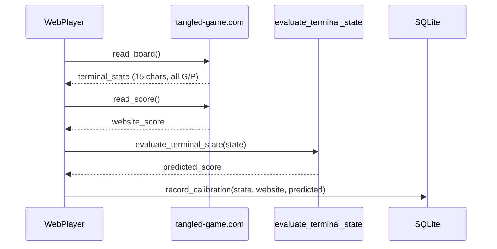
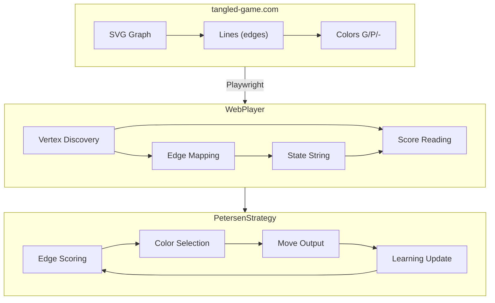
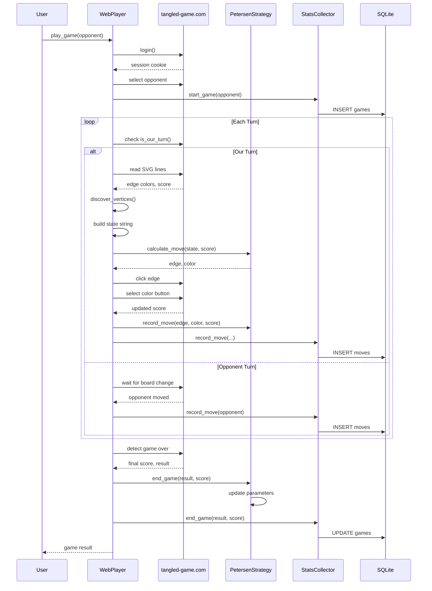

# Theory of Operation

This document provides comprehensive documentation of the Snowdrop Tangled Agents
project, including the game mechanics, strategy algorithms, web automation system,
and learning mechanisms.

## Table of Contents

1. [Project Overview](#project-overview)
2. [The Tangled Game](#the-tangled-game)
3. [Petersen Graph Structure](#petersen-graph-structure)
4. [Strategy Engine](#strategy-engine)
5. [MCTS Strategy](#mcts-strategy)
6. [Hybrid Strategy](#hybrid-strategy)
7. [Web Automation](#web-automation)
8. [Learning System](#learning-system)
9. [Statistics Collection](#statistics-collection)
10. [Adjudicator Calibration](#adjudicator-calibration)
11. [Architecture](#architecture)

---

## Project Overview

This project implements intelligent agents for the Tangled quantum game, a two-player
combinatorial game played on graph structures. The primary focus is the Petersen graph
(Graph #11), with a parameterized strategy engine that learns from game outcomes.

### Components

```
snowdrop-tangled-agents/
├── snowdrop_tangled_agents/
│   ├── agents/
│   │   ├── petersen_agent.py    # SDK-compatible agent wrapper
│   │   └── random_randy.py      # Baseline random agent
│   ├── strategy/
│   │   ├── petersen_strategy.py # Heuristic strategy engine
│   │   └── mcts_strategy.py     # MCTS and Hybrid strategies
│   ├── stats/
│   │   ├── collector.py         # SQLite stats collection
│   │   └── queries.py           # Analysis query functions
│   └── playing_games/
│       └── run_local_parallel_tournament.py
├── play_tangled.py              # Web automation for tangled-game.com
└── docs/
    └── tangled-bot-v28.txt      # Reference JS implementation
```

---

## The Tangled Game

### Game Mechanics

Tangled is a two-player game where players take turns coloring edges of a graph:

- **Green (Ferromagnetic/FM)**: Rewards vertices having the same spin
- **Purple (Antiferromagnetic/AFM)**: Rewards vertices having opposite spins

### Scoring

After all edges are colored, a quantum adjudicator determines the optimal spin
configuration for each vertex. The score is computed as:

```
Score = (Green edges with matching spins) - (Green edges with opposite spins)
      + (Purple edges with opposite spins) - (Purple edges with matching spins)
```

Player 1 (Red) wins if score > 0, Player 2 (Blue) wins if score < 0.

### Player Vertices

Each player has a "home" vertex:
- **Player 1 (Red)**: Vertex 5 (left side of outer pentagon)
- **Player 2 (Blue)**: Vertex 7 (right side of outer pentagon)
- **Hub Vertex**: Vertex 6 (top, strategically important)

---

## Petersen Graph Structure

The Petersen graph has 10 vertices and 15 edges, arranged as:
- **Outer Pentagon**: Vertices 5, 6, 7, 8, 9
- **Inner Pentagram**: Vertices 0, 1, 2, 3, 4 (star pattern)

### Edge List

```python
PETERSEN_EDGES = [
    (0, 2), (0, 3), (0, 6),  # E0-E2: Inner vertex 0 connections
    (1, 3), (1, 4), (1, 7),  # E3-E5: Inner vertex 1 connections
    (2, 4), (2, 8),          # E6-E7: Inner vertex 2 connections
    (3, 9),                   # E8: Inner vertex 3 connection
    (4, 5),                   # E9: Spoke to Player 1 vertex
    (5, 6), (5, 9),          # E10-E11: Player 1 vertex edges
    (6, 7),                   # E12: Hub edge (connects P1 and P2 regions)
    (7, 8), (8, 9),          # E13-E14: Remaining outer edges
]
```

### Visual Layout

```
                    V6 (HUB)
                      /\
                     /  \
                    /    \
              V5 (RED)    V7 (BLUE)
               /\          /\
              /  \        /  \
             /    \      /    \
           V9------V8---+
            \      /
             \    /
          [Inner Pentagram]
             V0-V4
```

### Strategic Edge Classifications

| Category | Edges | Description |
|----------|-------|-------------|
| MY_EDGES | E9, E10, E11 | Touch Player 1's vertex (5) |
| OPP_EDGES | E5, E12, E13 | Touch Player 2's vertex (7) |
| HUB_EDGES | E2, E10, E12 | Touch the hub vertex (6) |

---

## Strategy Engine

### PetersenStrategy Class

Located in `snowdrop_tangled_agents/strategy/petersen_strategy.py`

#### Parameters

```python
DEFAULT_PARAMS = {
    # Priority weights (higher = play first)
    "w_my_edge": 10.0,      # Edges touching our vertex
    "w_opp_edge": 8.0,      # Edges touching opponent's vertex
    "w_hub_edge": 5.0,      # Edges touching hub vertex
    "w_neutral": 1.0,       # Other edges

    # Hub preference multiplier
    "hub_priority": 0.8,

    # Color decision thresholds
    "green_threshold": 1.0,   # Play green if score > threshold
    "purple_threshold": -1.0, # Play purple if score < threshold

    # Adaptive factors
    "momentum_weight": 0.5,      # Weight of recent score trend
    "opp_pattern_weight": 0.3,   # Weight of opponent analysis

    # Per-edge learned values
    "edge_values": [0.0] * 15,   # Adjusted by learning

    # Strategy mode
    "strategy_mode": "adaptive", # "defensive", "aggressive", or "adaptive"

    # Opening book
    "opening_sequence": [(9, 'G'), (10, 'G'), (11, 'G')],
}
```

#### Move Calculation Algorithm

```
calculate_move(state, score, score_history):
    1. Check opening sequence override
    2. Score all available (grey) edges:
       - Base score from edge_values[i]
       - Add category bonus (my/opp/hub/neutral)
       - Add hub priority bonus if applicable
       - Add momentum adjustment
       - Add opponent pattern adjustment
    3. Select highest-scoring edge
    4. Choose color based on:
       - MY_EDGES → Green (always)
       - OPP_EDGES → Purple (always)
       - Others → Based on mode and score thresholds
```

#### Edge Scoring Formula

```
score(edge) = edge_values[edge]
            + category_weight(edge)
            + hub_bonus(edge)
            + momentum * momentum_weight
            + opp_preference[edge] * opp_pattern_weight
```

#### Color Selection Logic

```python
def choose_color(edge, score):
    if edge in MY_EDGES:
        return 'G'  # Always green on our edges
    if edge in OPP_EDGES:
        return 'P'  # Always purple on opponent edges

    if mode == "defensive":
        return 'G'
    elif mode == "aggressive":
        return 'P'
    else:  # adaptive
        if score > green_threshold:
            return 'G'  # Protect lead
        elif score < purple_threshold:
            return 'P'  # Attack when behind
        else:
            return 'G'  # Default defensive
```

---

## MCTS Strategy

Located in `snowdrop_tangled_agents/strategy/mcts_strategy.py`

### Overview

Monte Carlo Tree Search (MCTS) provides deeper lookahead than heuristic-only approaches.
This implementation uses UCB1 with Progressive Bias to compete against MCTS-based opponents
like Melissa.

### Key Features

- **Progressive Bias**: Heuristic priors guide early exploration, decay with visits
- **Action Prioritization**: Good moves expanded first based on domain knowledge
- **Domain-Specific Rollouts**: Uses Tangled heuristics instead of random play
- **Terminal State Evaluation**: Brute-force 2^10 spin enumeration for exact scores

### UCB1 with Progressive Bias

```
UCB1(node) = Q/N + c*sqrt(ln(parent.N)/N) + w*(prior - 0.5)/(N + 1)

Where:
  Q = total value accumulated
  N = visit count
  c = exploration constant (√2 ≈ 1.414)
  w = prior weight (decays with visits)
  prior = heuristic action prior [0, 1]
```

### Action Priors

```python
def compute_action_prior(edge, color, is_our_turn):
    if edge in MY_EDGES:
        return 0.99 if color == 'G' else 0.01  # Always Green
    elif edge in OPP_EDGES:
        return 0.95 if color == 'P' else 0.05  # Always Purple
    elif edge in GOOD_PURPLE_EDGES and color == 'P':
        return 0.80  # Favor Purple on inner edges
    elif edge in BAD_PURPLE_EDGES and color == 'P':
        return 0.10  # Avoid Purple on problematic edges
    # ... additional heuristics
```

### Edge Classifications (Empirically Derived)

| Category | Edges | Strategy |
|----------|-------|----------|
| MY_EDGES | E9, E10, E11 | Always Green |
| OPP_EDGES | E5, E12, E13 | Always Purple |
| GOOD_PURPLE | E0, E1, E3 | Purple often works |
| BAD_PURPLE | E2, E4, E6, E7, E8, E14 | Avoid Purple |

### Terminal State Evaluation

```python
def evaluate_terminal_state(state: str) -> float:
    """Enumerate all 2^10 spin configurations."""
    best_score = float('-inf')
    for config in range(1 << 10):
        spins = [2 * ((config >> i) & 1) - 1 for i in range(10)]
        score = sum(
            (1 if spins[v1] == spins[v2] else -1) if color == 'G'
            else (1 if spins[v1] != spins[v2] else -1)
            for (v1, v2), color in zip(EDGES, state)
        )
        best_score = max(best_score, score)
    return best_score / 15  # Normalize
```

---

## Hybrid Strategy

Combines MCTS with heuristic opening, exhaustive endgame, and learning.

### Strategy Phases

```
Game Phase      Edges Left    Strategy
─────────────────────────────────────────
Opening         15-11         Heuristic sequence (E9→E10→E11→E5 Green/Purple)
Midgame         10-3          MCTS with Progressive Bias
Endgame         2-1           Exhaustive minimax search
```

### Opening Sequence

```python
opening_sequence = [
    (9, 'G'),   # E9: Secure our spoke first
    (10, 'G'),  # E10: Hub connection
    (11, 'G'),  # E11: Complete vertex 5 protection
    (5, 'P'),   # E5: Attack opponent's spoke
    (12, 'P'),  # E12: Attack hub-to-opponent connection
    (13, 'P'),  # E13: Complete attack on vertex 7
]
```

### Endgame Minimax

When ≤2 edges remain, exhaustive search replaces MCTS:

```python
def _exhaustive_endgame(state):
    best_move, best_value = None, float('-inf')
    for edge in available_edges:
        for color in ['G', 'P']:
            value = minimax(apply_move(state, edge, color),
                           is_our_turn=False, depth=4)
            if value > best_value:
                best_value, best_move = value, (edge, color)
    return best_move
```

### Adaptive Time Allocation

```python
if grey_count <= 4:
    mcts.time_limit = base_time * 3  # More time for critical moves
else:
    mcts.time_limit = base_time
```

### Learning Integration

The Hybrid strategy records moves and learns from outcomes:

```python
def record_move(edge, color, score_after):
    self.move_history.append((edge, color, score_after))

def end_game(result, final_score):
    reward = compute_reward(result, final_score)
    for i, (edge, color, _) in enumerate(self.move_history):
        discount = 0.9 ** (len(history) - i - 1)
        self.edge_adjustments[edge] += learning_rate * reward * discount
```

---

## Web Automation

### play_tangled.py

Automates gameplay on tangled-game.com using Playwright.

### Dynamic Vertex Discovery

The website renders the Petersen graph as SVG `<line>` elements. Vertex positions
vary, so we dynamically discover them:

```
1. Collect all line endpoints
2. Cluster points within 5px tolerance → 10 unique vertices
3. Calculate center of mass
4. Separate by distance: outer 5 (far) vs inner 5 (close)
5. Sort each group by angle from center
6. Rotate outer so leftmost (angle ≈ π) is vertex 5
7. Rotate inner so topmost (angle ≈ -π/2) is vertex 0
8. Build vertex map: VTX[0-4] = inner, VTX[5-9] = outer
```

### Angle Wrap-Around Handling

```javascript
const angleDist = (a1, a2) => {
    let d = a1 - a2;
    while (d > Math.PI) d -= 2 * Math.PI;
    while (d < -Math.PI) d += 2 * Math.PI;
    return Math.abs(d);
};
```

### Edge-to-Line Mapping

```
For each SVG line:
    1. Get endpoints (x1,y1) and (x2,y2)
    2. Find nearest vertex for each endpoint
    3. Look up edge index in PETERSEN_EDGES
    4. Extract color from stroke attribute
```

### Move Execution

```
execute_move(edge, color):
    1. Discover vertices dynamically
    2. Find line connecting edge vertices
    3. Verify line is grey (available)
    4. Dispatch click event on line center
    5. Wait for color dialog
    6. Click color button (Green/Purple/FM/AFM)
```

### Turn Detection

```python
def is_our_turn():
    text = page.inner_text("body").lower()
    if "your turn" in text:
        return True
    if "player 1" in text and "turn" in text:
        return True
    if "opponent" in text and "turn" in text:
        return False
    if "waiting" in text:
        return False
    return False
```

### Browser Lifecycle Management

```python
# Signal handlers for cleanup
signal.signal(signal.SIGTERM, _signal_handler)
signal.signal(signal.SIGINT, _signal_handler)
atexit.register(_cleanup_on_exit)

# Context manager support
with WebPlayer() as player:
    player.login()
    player.play_game("melissa")
# Browser automatically closed on exit
```

---

## Learning System

### REINFORCE-Style Policy Gradient

After each game, the strategy updates based on outcomes using a simplified
REINFORCE algorithm:

#### Discounted Returns

```python
gamma = 0.95  # Discount factor
G = outcome_bonus * 2.0  # Terminal reward (+2 win, -2 loss)

# Work backwards through moves
for i in range(len(history) - 1, -1, -1):
    immediate_reward = score_after - score_before
    G = immediate_reward + gamma * G
    returns[i] = G

# Normalize returns
returns = (returns - mean) / std
```

#### Parameter Updates

```python
base_lr = 0.05

for edge, color, _ in history:
    advantage = returns[i]
    update = base_lr * advantage
    edge_values[edge] = clamp(edge_values[edge] + update, 0.0, 2.0)
```

#### Adaptive Weight Adjustment

```python
if result == "loss":
    if final_score < -1.0:
        # Lost badly → increase opponent edge priority
        w_opp_edge += 0.5
    elif final_score > 0:
        # Lost despite positive score → increase own edge priority
        w_my_edge += 0.5
```

#### Opening Sequence Adaptation

```python
if result == "loss" and early_score < -0.5:
    # Poor opening → try swapping first two moves
    opening_sequence = [opening[1], opening[0]] + opening[2:]
```

### Parameter Persistence

```python
# Auto-save after each game
params_path = ~/.tangled/petersen_params.json
strategy.save_params(params_path)

# Load on startup
if os.path.exists(params_path):
    strategy.load_params(params_path)
```

---

## Statistics Collection

Located in `snowdrop_tangled_agents/stats/`

### Overview

SQLite-based statistics collection enables analysis of game patterns, edge effectiveness,
and opponent behavior to guide strategy improvements.

### Database Schema

```sql
-- Game metadata
CREATE TABLE games (
    id TEXT PRIMARY KEY,
    timestamp DATETIME DEFAULT CURRENT_TIMESTAMP,
    opponent TEXT NOT NULL,
    graph TEXT DEFAULT 'petersen',
    result TEXT,           -- 'win', 'loss', 'draw'
    final_score REAL,
    total_moves INTEGER,
    strategy TEXT,         -- 'hybrid', 'mcts', 'heuristic'
    mcts_time REAL
);

-- Move-by-move data
CREATE TABLE moves (
    id INTEGER PRIMARY KEY AUTOINCREMENT,
    game_id TEXT REFERENCES games(id),
    move_number INTEGER,
    player TEXT,           -- 'us', 'opponent'
    edge INTEGER,          -- 0-14
    color TEXT,            -- 'G', 'P'
    score_after REAL,
    score_delta REAL,
    state_after TEXT       -- 15-char board state
);
```

### Database Location

```
~/.tangled/game_stats.db
```

### StatsCollector Class

```python
from snowdrop_tangled_agents.stats import get_collector

collector = get_collector()

# Start tracking a game
game_id = collector.start_game(opponent="melissa", strategy="hybrid")

# Record each move
collector.record_move(
    game_id=game_id,
    move_number=1,
    player="us",
    edge=9,
    color="G",
    score_after=1.02,
    score_before=0.0,
    state_after="--------G------"
)

# End game
collector.end_game(game_id, result="win", final_score=2.04)
```

### Analysis Queries

```python
from snowdrop_tangled_agents.stats import queries

# Edge effectiveness (which edge/color combos work best)
edges = queries.get_edge_effectiveness(min_games=3)
for e in edges:
    print(f"E{e.edge} {e.color}: delta={e.avg_delta:+.3f}, win_rate={e.win_rate:.1%}")

# Score progression by result
win_prog = queries.get_score_progression(result='win')
loss_prog = queries.get_score_progression(result='loss')

# Winning patterns at specific move
patterns = queries.get_winning_patterns(move_number=4)

# Opening sequence analysis
openings = queries.get_opening_sequences(num_moves=4)

# Critical positions (large score swings)
critical = queries.get_critical_positions(score_swing_threshold=0.5)

# Opponent behavior analysis
opp = queries.get_opponent_patterns(opponent="melissa")
```

### CLI Access

```bash
# View statistics summary
python play_tangled.py --stats

# Stats are automatically shown after game sessions
python play_tangled.py --games 10
```

### Example Output

```
============================================================
GAME STATISTICS SUMMARY
============================================================

Total Games: 51
  Wins:   2 (3.9%)
  Losses: 42 (82.4%)
  Draws:  7 (13.7%)

------------------------------------------------------------
TOP EDGE/COLOR COMBINATIONS (by avg score delta)
------------------------------------------------------------
Edge     Color    Avg Delta    Win Rate     Games
E9       G        +0.982       3.9%         51
E10      G        +0.043       3.9%         48
E11      G        -0.015       4.2%         47
E12      P        -0.456       3.8%         26

------------------------------------------------------------
SCORE PROGRESSION (Wins vs Losses)
------------------------------------------------------------
Move     Win Avg      Loss Avg
1        +1.029       +0.994
2        +1.487       +0.876
3        +1.134       +0.654
4        +0.690       +0.212
5        +0.413       -0.098
```

### Integration with play_tangled.py

Statistics are collected automatically during gameplay:

```python
class WebPlayer:
    def __init__(self):
        self.stats_collector = get_collector()

    def play_game(self, opponent):
        # Start game tracking
        self.current_game_id = self.stats_collector.start_game(
            opponent=opponent,
            strategy=self.strategy_type
        )

        # ... gameplay loop ...

        # Record each move
        self.stats_collector.record_move(
            game_id=self.current_game_id,
            move_number=move_count,
            player="us",
            edge=edge,
            color=color,
            score_after=new_score,
            score_before=prev_score
        )

        # End game
        self.stats_collector.end_game(
            game_id=self.current_game_id,
            result=result,
            final_score=final_score
        )
```

---

## Adjudicator Calibration

Calibration compares our terminal state evaluation against actual game scores from
tangled-game.com. This validates whether our scoring model matches the website's
quantum adjudicator.

### Why Calibration Matters

If our `evaluate_terminal_state()` function produces different scores than the website:
- MCTS optimizes for the wrong objective
- Move selection is based on incorrect position evaluation
- This could explain poor game performance despite sound strategy logic

### Terminal State Evaluation

Our evaluator uses brute-force enumeration of all 2^10 spin configurations:

```python
def evaluate_terminal_state(state: str) -> float:
    """
    Evaluate a terminal state (all 15 edges colored).

    Enumerates all 1024 possible spin configurations to find
    the one that maximizes the score.
    """
    best_score = float('-inf')

    for config in range(1 << 10):  # 2^10 = 1024 configurations
        spins = [2 * ((config >> i) & 1) - 1 for i in range(10)]

        score = 0
        for edge_idx, (v1, v2) in enumerate(PETERSEN_EDGES):
            color = state[edge_idx]
            same_spin = (spins[v1] == spins[v2])

            if color == 'G':  # Green/Ferromagnetic
                score += 1 if same_spin else -1
            else:  # Purple/Antiferromagnetic
                score += 1 if not same_spin else -1

        best_score = max(best_score, score)

    return best_score / 15  # Normalize to [-1, 1]
```

### Calibration Data Collection

At game end, when all 15 edges are colored:



### Database Schema

```sql
CREATE TABLE calibration (
    id INTEGER PRIMARY KEY AUTOINCREMENT,
    game_id TEXT REFERENCES games(id),
    timestamp DATETIME DEFAULT CURRENT_TIMESTAMP,
    terminal_state TEXT NOT NULL,    -- 15-char final board
    website_score REAL NOT NULL,     -- From tangled-game.com
    predicted_score REAL NOT NULL,   -- Our evaluation
    error REAL NOT NULL,             -- predicted - website
    abs_error REAL NOT NULL          -- |error|
);
```

### CLI Access

```bash
# View calibration report
python play_tangled.py --calibration
```

### Calibration Report

The report shows:

- **Error Metrics**: Mean error (bias), mean absolute error, max error
- **Error Distribution**: Percentage exact (<0.01), close (<0.1), moderate (<0.5), large (>=0.5)
- **Worst Cases**: Terminal states with largest prediction errors
- **Interpretation**: Whether calibration is excellent, good, moderate, or poor

### Example Output

```
============================================================
ADJUDICATOR CALIBRATION REPORT
============================================================

Total Calibrations: 25

Error Metrics (predicted - website):
  Mean Error:     +0.0234
  Mean Abs Error: 0.0456
  Max Abs Error:  0.1200
  Error Range:    [-0.0800, +0.1200]

Score Averages:
  Website Avg:    -0.2456
  Predicted Avg:  -0.2222

Error Distribution:
  < 0.01 (exact)      8 (32.0%) ################
  < 0.10 (close)     15 (60.0%) ##############################
  < 0.50 (moderate)   2 ( 8.0%) ####
  >= 0.50 (large)     0 ( 0.0%)

------------------------------------------------------------
INTERPRETATION
------------------------------------------------------------
Good calibration - minor systematic differences.
```

### Potential Calibration Issues

| Issue | Symptom | Resolution |
|-------|---------|------------|
| Score normalization | Large systematic bias | Adjust normalization factor |
| Edge ordering | Random-looking errors | Verify PETERSEN_EDGES matches website |
| Color mapping | Consistent sign flip | Check G/P color detection |
| Quantum effects | Small systematic error | Website may use actual quantum solver |

---

## Architecture

### Data Flow



### Gameplay Transaction Flow



### State Representation

```
State String: "---G-----GGP---"
              |||||||||||||||
              E0............E14

'-' = Grey (available)
'G' = Green (Ferromagnetic)
'P' = Purple (Antiferromagnetic)
'?' = Unknown (opponent's move, color not visible)
```

### Score History Format

```python
score_history = [
    (edge_index, color, score_after_move),
    (9, 'G', 1.008),   # Move 1: E9 Green, score became 1.008
    (10, 'G', 0.956),  # Move 2: E10 Green, score became 0.956
    ...
]
```

---

## Usage

### Running the Web Bot

```bash
# Play 5 games against MCTS Melissa
python play_tangled.py

# Play 10 games against Random Randy
python play_tangled.py --opponent randy --games 10

# Keep browser open 10 seconds after games
python play_tangled.py --keep-open 10

# Enable debug logging
python play_tangled.py --debug

# View game statistics summary
python play_tangled.py --stats

# View adjudicator calibration report
python play_tangled.py --calibration
```

### Environment Setup

Create `.env` file:
```
TANGLED_USERNAME=your_username
TANGLED_PASSWORD=your_password
```

### Running Local Tournament

```bash
poetry run python snowdrop_tangled_agents/playing_games/run_local_parallel_tournament.py
```

---

## Future Improvements

### Completed

- ~~Monte Carlo Tree Search~~: Implemented with Progressive Bias (mcts_strategy.py)
- ~~Opening Book~~: Heuristic opening sequence in HybridStrategy
- ~~Statistics Database~~: SQLite-based game analytics (stats module)
- ~~Adjudicator Calibration~~: Terminal state evaluation comparison (calibration table)

### In Progress

- **Pattern Learning**: Use collected statistics to identify winning patterns
- **Opening Book Refinement**: Analyze successful openings from database

### Planned (by priority)

1. **Opening Response Table**: Pre-compute optimal responses to opponent's first moves
2. **Advanced Opponent Modeling**: Build predictive models of Melissa's responses
3. **Neural Network Policy**: Train a neural net on game outcomes for move evaluation
4. **Multi-Graph Support**: Extend strategy to other X-Prize graphs (2, 12, 18, 19, 20)
5. **Real-Time Dashboard**: Visualize statistics and game patterns
