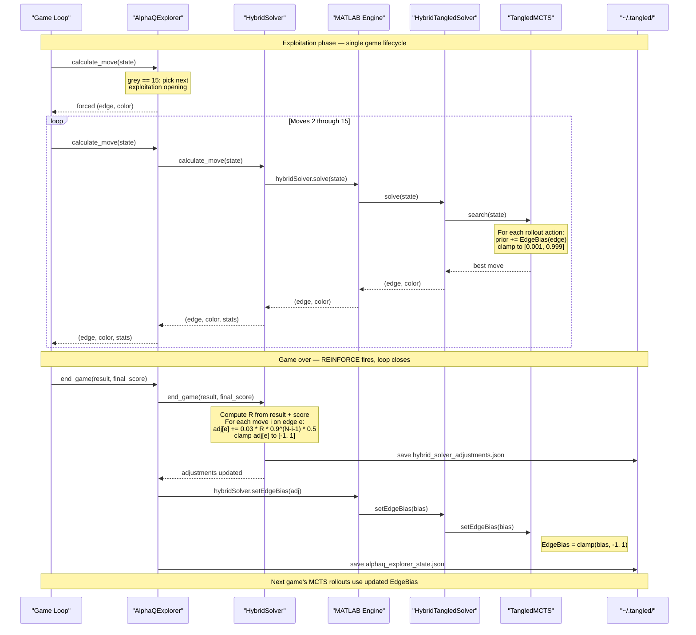

# Dynamic Learning Implementation Plan

This document outlines the phased implementation of dynamic/online learning for the Tangled game agent using MATLAB's Reinforcement Learning Toolbox.

## Architecture Overview

```
┌─────────────────────────────────────────────────────────────────────────────┐
│                         DYNAMIC LEARNING SYSTEM                              │
├─────────────────────────────────────────────────────────────────────────────┤
│                                                                              │
│  ┌────────────┐   ┌────────────┐   ┌────────────┐   ┌────────────┐        │
│  │  Phase 2   │──►│  Phase 3   │──►│  Phase 4   │──►│  Phase 5   │        │
│  │    RL      │   │    PPO     │   │  Parallel  │   │   Deploy   │        │
│  │Environment │   │   Agent    │   │ Self-Play  │   │  Pipeline  │        │
│  └────────────┘   └────────────┘   └────────────┘   └────────────┘        │
│        │                │                │                │                 │
│        └────────────────┴────────────────┴────────────────┘                 │
│                                   │                                         │
│                                   ▼                                         │
│                          ┌────────────────┐                                │
│                          │    Phase 6     │                                │
│                          │   Continuous   │                                │
│                          │   Improvement  │                                │
│                          └────────────────┘                                │
└─────────────────────────────────────────────────────────────────────────────┘
```

---

## Phase 1: Offline Training (Current)

**Status**: ✅ Complete

- Collecting game data via web play
- SQLite database for game/move storage
- Value network training with Deep Learning Toolbox
- 100+ games collected and stored

---

## Phase 2: RL Environment Wrapper

**Status**: ✅ Complete

**Goal**: Wrap the Tangled game as a MATLAB RL environment compatible with RL Toolbox agents.

**Implemented Files** (`snowdrop_tangled_agents/matlab/rl/`):
- `TangledEnvironment.m` - Main RL environment class
- `getActionMask.m` - Valid action masking (30 actions: 15 edges × 2 colors)
- `buildFeatures.m` - 50-element observation vector construction
- `test_environment.m` - Unit tests for environment

### 2.1 Observation Space

```matlab
% File: C:\Users\murr2\MATLAB Drive\tangled_rl\TangledObservation.m

% Observation: 50-element vector (same as value network input)
obsInfo = rlNumericSpec([50 1], ...
    'LowerLimit', -1, ...
    'UpperLimit', 1, ...
    'Name', 'TangledState');

% Components:
%   1-15:  Board state (-1=Purple, 0=Grey, +1=Green)
%   16:    Turn indicator (+1=us, -1=opponent)
%   17-31: Edge categories (MY/OPP/HUB/NEUTRAL encoding)
%   32:    Grey count (normalized 0-1)
%   33-35: Score momentum (last 3 deltas, normalized)
%   36-50: Game phase one-hot (opening/mid/end × 5 substates)
```

### 2.2 Action Space

```matlab
% File: C:\Users\murr2\MATLAB Drive\tangled_rl\TangledAction.m

% Action: Discrete, 30 possible actions (15 edges × 2 colors)
actInfo = rlFiniteSetSpec(1:30);
actInfo.Name = 'TangledAction';

% Mapping:
%   Actions 1-15:  Play Green on edges 0-14
%   Actions 16-30: Play Purple on edges 0-14
%
% Invalid actions (non-grey edges) are masked in the step function
```

### 2.3 Environment Implementation

```matlab
% File: C:\Users\murr2\MATLAB Drive\tangled_rl\TangledEnvironment.m

classdef TangledEnvironment < rl.env.MATLABEnvironment
    properties
        State           % Current 15-char board state
        Score           % Current game score
        MoveCount       % Number of moves made
        MaxMoves        % Maximum moves (15 for Petersen)
        Adjudicator     % SimulatedAnnealing for terminal eval
        OpponentPolicy  % Opponent model (MCTS Melissa simulation)
    end

    methods
        function this = TangledEnvironment()
            % Initialize observation and action specs
            obsInfo = rlNumericSpec([50 1], 'LowerLimit', -1, 'UpperLimit', 1);
            actInfo = rlFiniteSetSpec(1:30);

            this = this@rl.env.MATLABEnvironment(obsInfo, actInfo);
            this.MaxMoves = 15;
            this.Adjudicator = SimulatedAnnealingAdjudicator();
            this.reset();
        end

        function [obs, reward, isDone, info] = step(this, action)
            % Decode action
            if action <= 15
                edge = action - 1;
                color = 'G';
            else
                edge = action - 16;
                color = 'P';
            end

            % Validate action (must be grey edge)
            if this.State(edge + 1) ~= '-'
                % Invalid action penalty
                reward = -1.0;
                obs = this.getObservation();
                isDone = false;
                info = struct('InvalidAction', true);
                return;
            end

            % Apply our move
            this.State(edge + 1) = color;
            this.MoveCount = this.MoveCount + 1;

            % Check if game over
            if this.MoveCount >= this.MaxMoves
                % Terminal state - get final score
                finalScore = this.Adjudicator.evaluate(this.State);
                reward = tanh(finalScore / 3);  % Normalize to [-1, 1]
                isDone = true;
            else
                % Opponent's turn
                oppMove = this.OpponentPolicy.selectMove(this.State);
                this.State(oppMove.edge + 1) = oppMove.color;
                this.MoveCount = this.MoveCount + 1;

                % Intermediate reward (score delta)
                newScore = this.evaluatePosition();
                reward = (newScore - this.Score) * 0.1;  % Small shaping reward
                this.Score = newScore;

                isDone = this.MoveCount >= this.MaxMoves;
                if isDone
                    finalScore = this.Adjudicator.evaluate(this.State);
                    reward = tanh(finalScore / 3);
                end
            end

            obs = this.getObservation();
            info = struct('State', this.State, 'Score', this.Score);
        end

        function obs = reset(this)
            this.State = repmat('-', 1, 15);
            this.Score = 0;
            this.MoveCount = 0;
            obs = this.getObservation();
        end

        function obs = getObservation(this)
            obs = buildFeatures(this.State, 1);  % 50-element vector
        end
    end
end
```

### 2.4 Action Masking for Invalid Moves

```matlab
% File: C:\Users\murr2\MATLAB Drive\tangled_rl\getActionMask.m

function mask = getActionMask(state)
%GETACTIONMASK Return valid action mask for current state
%
%   mask(i) = 1 if action i is valid, 0 otherwise

    mask = zeros(30, 1);

    for i = 1:15
        if state(i) == '-'
            mask(i) = 1;      % Green on edge i-1 is valid
            mask(i + 15) = 1; % Purple on edge i-1 is valid
        end
    end
end
```

### 2.5 Deliverables

| File | Purpose |
|------|---------|
| `TangledEnvironment.m` | Main RL environment class |
| `TangledObservation.m` | Observation space definition |
| `TangledAction.m` | Action space definition |
| `getActionMask.m` | Valid action masking |
| `SimulatedOpponent.m` | MCTS Melissa behavior model |
| `test_environment.m` | Unit tests for environment |

---

## Phase 3: PPO Agent with Experience Replay

**Status**: ✅ Complete

**Goal**: Implement a Proximal Policy Optimization agent that learns from gameplay.

**Implemented Files** (`snowdrop_tangled_agents/matlab/rl/`):
- `createPPOAgent.m` - PPO agent configuration with action masking
- `createPPONetworks.m` - Actor/critic network definitions (50→128→64→30/1)
- `SQLiteExperienceBuffer.m` - Persistent experience storage
- `trainPPOAgent.m` - Training loop with GAE and masked actions
- `test_ppo.m` - Unit tests for PPO agent

### 3.1 Why PPO?

| Algorithm | Pros | Cons |
|-----------|------|------|
| DQN | Simple, stable | Discrete only, no policy |
| A2C | Fast, on-policy | High variance |
| **PPO** | Stable, continuous+discrete, SOTA | More hyperparameters |
| SAC | Sample efficient | Continuous only |

PPO is ideal because:
- Works with discrete action spaces
- Stable training (clipped objective)
- Good sample efficiency
- Supports action masking

### 3.2 Network Architecture

```matlab
% File: C:\Users\murr2\MATLAB Drive\tangled_rl\createPPONetworks.m

function [actor, critic] = createPPONetworks(obsInfo, actInfo)
%CREATEPPONETWORKS Create actor and critic networks for PPO agent

    %% Shared feature extractor
    commonPath = [
        featureInputLayer(50, 'Name', 'state')
        fullyConnectedLayer(128, 'Name', 'fc1')
        reluLayer('Name', 'relu1')
        fullyConnectedLayer(64, 'Name', 'fc2')
        reluLayer('Name', 'relu2')
    ];

    %% Actor (Policy) Network
    % Outputs action probabilities for each of 30 actions
    actorPath = [
        commonPath
        fullyConnectedLayer(30, 'Name', 'fc_actor')
        softmaxLayer('Name', 'actionProb')
    ];

    actor = dlnetwork(actorPath);

    %% Critic (Value) Network
    % Outputs single state value
    criticPath = [
        commonPath
        fullyConnectedLayer(32, 'Name', 'fc_critic')
        reluLayer('Name', 'relu_critic')
        fullyConnectedLayer(1, 'Name', 'value')
    ];

    critic = dlnetwork(criticPath);
end
```

### 3.3 PPO Agent Configuration

```matlab
% File: C:\Users\murr2\MATLAB Drive\tangled_rl\createPPOAgent.m

function agent = createPPOAgent(env)
%CREATEPPOAGENT Create configured PPO agent for Tangled

    obsInfo = getObservationInfo(env);
    actInfo = getActionInfo(env);

    % Create networks
    [actorNet, criticNet] = createPPONetworks(obsInfo, actInfo);

    % Actor representation
    actor = rlDiscreteCategoricalActor(actorNet, obsInfo, actInfo);

    % Critic representation
    critic = rlValueFunction(criticNet, obsInfo);

    % PPO Agent options
    agentOpts = rlPPOAgentOptions(...
        'ExperienceHorizon', 128, ...        % Steps before update
        'ClipFactor', 0.2, ...               % PPO clip parameter
        'EntropyLossWeight', 0.01, ...       % Exploration bonus
        'MiniBatchSize', 32, ...
        'NumEpoch', 4, ...                   % Epochs per update
        'AdvantageEstimateMethod', 'gae', ...% Generalized Advantage
        'GAEFactor', 0.95, ...
        'SampleTime', 1, ...
        'DiscountFactor', 0.99);

    % Learning rates
    agentOpts.ActorOptimizerOptions = rlOptimizerOptions(...
        'LearnRate', 3e-4, ...
        'GradientThreshold', 1);

    agentOpts.CriticOptimizerOptions = rlOptimizerOptions(...
        'LearnRate', 1e-3, ...
        'GradientThreshold', 1);

    % Create agent
    agent = rlPPOAgent(actor, critic, agentOpts);
end
```

### 3.4 Experience Replay Buffer (SQLite-backed)

```matlab
% File: C:\Users\murr2\MATLAB Drive\tangled_rl\SQLiteExperienceBuffer.m

classdef SQLiteExperienceBuffer < handle
%SQLITEEXPERIENCEBUFFER Persistent experience buffer backed by SQLite

    properties
        DBPath
        Connection
        MaxSize
        CurrentSize
    end

    methods
        function this = SQLiteExperienceBuffer(dbPath, maxSize)
            this.DBPath = dbPath;
            this.MaxSize = maxSize;
            this.Connection = sqlite(dbPath);
            this.initializeTable();
        end

        function initializeTable(this)
            exec(this.Connection, [...
                'CREATE TABLE IF NOT EXISTS experience (' ...
                '  id INTEGER PRIMARY KEY AUTOINCREMENT,' ...
                '  state BLOB,' ...
                '  action INTEGER,' ...
                '  reward REAL,' ...
                '  next_state BLOB,' ...
                '  done INTEGER,' ...
                '  timestamp DATETIME DEFAULT CURRENT_TIMESTAMP' ...
                ')']);
        end

        function add(this, state, action, reward, nextState, done)
            % Serialize states
            stateBlob = getByteStreamFromArray(state);
            nextStateBlob = getByteStreamFromArray(nextState);

            % Insert
            insert(this.Connection, 'experience', ...
                {'state', 'action', 'reward', 'next_state', 'done'}, ...
                {stateBlob, action, reward, nextStateBlob, done});

            % Prune if over max size
            this.pruneOldest();
        end

        function batch = sample(this, batchSize)
            % Random sample from buffer
            data = fetch(this.Connection, sprintf([...
                'SELECT state, action, reward, next_state, done ' ...
                'FROM experience ORDER BY RANDOM() LIMIT %d'], batchSize));

            batch = struct();
            batch.states = cellfun(@getArrayFromByteStream, data.state, 'Uni', 0);
            batch.actions = data.action;
            batch.rewards = data.reward;
            batch.nextStates = cellfun(@getArrayFromByteStream, data.next_state, 'Uni', 0);
            batch.dones = data.done;
        end

        function pruneOldest(this)
            count = fetch(this.Connection, 'SELECT COUNT(*) FROM experience');
            if count{1} > this.MaxSize
                excess = count{1} - this.MaxSize;
                exec(this.Connection, sprintf([...
                    'DELETE FROM experience WHERE id IN (' ...
                    '  SELECT id FROM experience ORDER BY timestamp LIMIT %d' ...
                    ')'], excess));
            end
        end
    end
end
```

### 3.5 Training Loop with Action Masking

```matlab
% File: C:\Users\murr2\MATLAB Drive\tangled_rl\trainPPOAgent.m

function trainedAgent = trainPPOAgent(agent, env, options)
%TRAINPPOAGENT Train PPO agent with action masking

    arguments
        agent
        env
        options.MaxEpisodes = 1000
        options.MaxStepsPerEpisode = 15
        options.SaveFrequency = 100
        options.DBPath = ''
    end

    % Training options
    trainOpts = rlTrainingOptions(...
        'MaxEpisodes', options.MaxEpisodes, ...
        'MaxStepsPerEpisode', options.MaxStepsPerEpisode, ...
        'ScoreAveragingWindowLength', 50, ...
        'Verbose', true, ...
        'Plots', 'training-progress', ...
        'StopTrainingCriteria', 'AverageReward', ...
        'StopTrainingValue', 0.8);  % Stop when avg reward > 0.8

    % Custom step function with action masking
    trainOpts.StepFunction = @(agent, env) maskedStep(agent, env);

    % Train
    trainingStats = train(agent, env, trainOpts);

    trainedAgent = agent;

    % Save final model
    save('tangled_ppo_agent.mat', 'trainedAgent', 'trainingStats');
end

function [action, actorOutput] = maskedStep(agent, env)
    % Get current state
    obs = getObservation(env);

    % Get action mask
    mask = getActionMask(env.State);

    % Get action probabilities from actor
    actorOutput = getAction(agent, obs);

    % Apply mask (set invalid actions to -inf before softmax)
    maskedLogits = actorOutput.ActionLogits;
    maskedLogits(mask == 0) = -1e10;

    % Sample from masked distribution
    probs = softmax(maskedLogits);
    action = randsample(1:30, 1, true, probs);
end
```

### 3.6 Deliverables

| File | Purpose |
|------|---------|
| `createPPONetworks.m` | Actor/critic network definitions |
| `createPPOAgent.m` | PPO agent configuration |
| `SQLiteExperienceBuffer.m` | Persistent experience storage |
| `trainPPOAgent.m` | Training loop with masking |
| `evaluateAgent.m` | Performance evaluation |

---

## Phase 4: Parallel Self-Play

**Status**: ✅ Complete

**Goal**: Accelerate learning through parallel game simulations.

**Implemented Files** (`snowdrop_tangled_agents/matlab/rl/`):
- `createParallelEnv.m` - Vectorized parallel environment with parpool support
- `trainParallel.m` - Parallel training loop with experience aggregation
- `collectEpisode.m` - Episode collection with action masking
- `enableGPU.m` - GPU acceleration for actor/critic networks
- `workerInit.m` - Worker initialization with unique seeds
- `test_parallel.m` - Unit tests for all Phase 4 components

### 4.1 Architecture

```
┌─────────────────────────────────────────────────────────────────┐
│                    PARALLEL SELF-PLAY                           │
├─────────────────────────────────────────────────────────────────┤
│                                                                 │
│  ┌─────────┐  ┌─────────┐  ┌─────────┐  ┌─────────┐           │
│  │Worker 1 │  │Worker 2 │  │Worker 3 │  │Worker N │           │
│  │ Game    │  │ Game    │  │ Game    │  │ Game    │           │
│  │ Env     │  │ Env     │  │ Env     │  │ Env     │           │
│  └────┬────┘  └────┬────┘  └────┬────┘  └────┬────┘           │
│       │            │            │            │                  │
│       └────────────┴─────┬──────┴────────────┘                  │
│                          │                                      │
│                          ▼                                      │
│              ┌───────────────────────┐                         │
│              │   Experience Buffer   │                         │
│              │      (SQLite)         │                         │
│              └───────────┬───────────┘                         │
│                          │                                      │
│                          ▼                                      │
│              ┌───────────────────────┐                         │
│              │    Central Learner    │                         │
│              │    (PPO Updates)      │                         │
│              └───────────┬───────────┘                         │
│                          │                                      │
│                          ▼                                      │
│              ┌───────────────────────┐                         │
│              │   Broadcast Updated   │                         │
│              │      Weights          │                         │
│              └───────────────────────┘                         │
│                                                                 │
└─────────────────────────────────────────────────────────────────┘
```

### 4.2 Parallel Environment Vector

```matlab
% File: C:\Users\murr2\MATLAB Drive\tangled_rl\createParallelEnv.m

function vecEnv = createParallelEnv(numWorkers)
%CREATEPARALLELENV Create vectorized parallel environment

    % Create environment instances
    envs = cell(numWorkers, 1);
    for i = 1:numWorkers
        envs{i} = TangledEnvironment();
    end

    % Create parallel environment
    vecEnv = rlSimulationEnvironment(envs);

    % Alternative: Use parpool for true parallelism
    % pool = parpool('local', numWorkers);
    % vecEnv = rlParallelEnv(envs, pool);
end
```

### 4.3 Parallel Training Loop

```matlab
% File: C:\Users\murr2\MATLAB Drive\tangled_rl\trainParallel.m

function trainedAgent = trainParallel(agent, numWorkers, options)
%TRAINPARALLEL Train agent using parallel self-play

    arguments
        agent
        numWorkers = 4
        options.MaxEpisodes = 10000
        options.UpdateFrequency = 128  % Steps across all workers
        options.DBPath = 'experience.db'
    end

    % Initialize parallel pool
    if isempty(gcp('nocreate'))
        parpool('local', numWorkers);
    end

    % Shared experience buffer
    buffer = SQLiteExperienceBuffer(options.DBPath, 100000);

    % Training metrics
    metrics = struct('rewards', [], 'losses', [], 'winRate', []);

    totalSteps = 0;
    episode = 0;

    while episode < options.MaxEpisodes
        % Parallel rollout
        experiences = cell(numWorkers, 1);

        parfor w = 1:numWorkers
            % Create local environment
            env = TangledEnvironment();

            % Collect episode
            experiences{w} = collectEpisode(agent, env);
        end

        % Aggregate experiences
        for w = 1:numWorkers
            exp = experiences{w};
            for t = 1:length(exp.states)
                buffer.add(exp.states{t}, exp.actions(t), ...
                    exp.rewards(t), exp.nextStates{t}, exp.dones(t));
            end
            totalSteps = totalSteps + length(exp.states);
        end

        episode = episode + numWorkers;

        % Update agent
        if totalSteps >= options.UpdateFrequency
            batch = buffer.sample(min(totalSteps, 256));
            agent = updateAgent(agent, batch);
            totalSteps = 0;

            % Log metrics
            metrics.rewards(end+1) = mean([experiences{:}].totalReward);
            fprintf('Episode %d: Avg Reward = %.3f\n', episode, metrics.rewards(end));
        end

        % Periodic save
        if mod(episode, 500) == 0
            save(sprintf('checkpoint_ep%d.mat', episode), 'agent', 'metrics');
        end
    end

    trainedAgent = agent;
end

function exp = collectEpisode(agent, env)
%COLLECTEPISODE Run one episode and collect experience

    exp = struct('states', {{}}, 'actions', [], 'rewards', [], ...
                 'nextStates', {{}}, 'dones', [], 'totalReward', 0);

    obs = reset(env);
    done = false;

    while ~done
        % Get masked action
        mask = getActionMask(env.State);
        action = selectMaskedAction(agent, obs, mask);

        % Step
        [nextObs, reward, done, ~] = step(env, action);

        % Store
        exp.states{end+1} = obs;
        exp.actions(end+1) = action;
        exp.rewards(end+1) = reward;
        exp.nextStates{end+1} = nextObs;
        exp.dones(end+1) = done;
        exp.totalReward = exp.totalReward + reward;

        obs = nextObs;
    end
end
```

### 4.4 GPU Acceleration

```matlab
% File: C:\Users\murr2\MATLAB Drive\tangled_rl\enableGPU.m

function agent = enableGPU(agent)
%ENABLEGPU Move agent networks to GPU for faster training

    if canUseGPU()
        % Move actor network to GPU
        actor = getActor(agent);
        actorNet = getModel(actor);
        actorNet = dlupdate(@gpuArray, actorNet);
        actor = setModel(actor, actorNet);
        agent = setActor(agent, actor);

        % Move critic network to GPU
        critic = getCritic(agent);
        criticNet = getModel(critic);
        criticNet = dlupdate(@gpuArray, criticNet);
        critic = setModel(critic, criticNet);
        agent = setCritic(agent, critic);

        fprintf('Agent networks moved to GPU\n');
    else
        warning('GPU not available, using CPU');
    end
end
```

### 4.5 Deliverables

| File | Purpose |
|------|---------|
| `createParallelEnv.m` | Vectorized environment |
| `trainParallel.m` | Parallel training loop |
| `collectEpisode.m` | Episode collection |
| `enableGPU.m` | GPU acceleration |
| `workerInit.m` | Worker initialization |

---

## Phase 5: Continuous Deployment Pipeline

**Status**: ✅ Complete

**Goal**: Hot-deploy updated models to the Python web player without restart.

**Implemented Files** (`snowdrop_tangled_agents/matlab/rl/`):
- `ModelRegistry.m` - Model version management and deployment tracking
- `tangled_agent_inference.m` - Compiled inference function with hot-reload
- `autoDeploy.m` - Automatic deployment based on performance improvement
- `build_rl_package.m` - MATLAB Compiler SDK build script for Python package
- `test_deployment.m` - Unit tests for Phase 5 components

**Python Integration** (`snowdrop_tangled_agents/matlab/`):
- `rl_bridge.py` - Python bridge with fallback chain (compiled → engine → heuristic)

### 5.1 Model Versioning System

```matlab
% File: C:\Users\murr2\MATLAB Drive\tangled_rl\ModelRegistry.m

classdef ModelRegistry < handle
%MODELREGISTRY Manage model versions and deployment

    properties
        DBPath
        ModelDir
        Connection
    end

    methods
        function this = ModelRegistry(dbPath, modelDir)
            this.DBPath = dbPath;
            this.ModelDir = modelDir;
            this.Connection = sqlite(dbPath);
            this.initializeTable();
        end

        function initializeTable(this)
            exec(this.Connection, [...
                'CREATE TABLE IF NOT EXISTS model_versions (' ...
                '  id INTEGER PRIMARY KEY AUTOINCREMENT,' ...
                '  version TEXT UNIQUE,' ...
                '  file_path TEXT,' ...
                '  training_episodes INTEGER,' ...
                '  avg_reward REAL,' ...
                '  win_rate REAL,' ...
                '  created DATETIME DEFAULT CURRENT_TIMESTAMP,' ...
                '  deployed BOOLEAN DEFAULT 0,' ...
                '  notes TEXT' ...
                ')']);
        end

        function version = registerModel(this, agent, metrics, notes)
            % Generate version string
            version = sprintf('v%s', datestr(now, 'yyyymmdd_HHMMSS'));

            % Save model file
            filePath = fullfile(this.ModelDir, [version '.mat']);
            save(filePath, 'agent');

            % Register in database
            insert(this.Connection, 'model_versions', ...
                {'version', 'file_path', 'training_episodes', 'avg_reward', 'win_rate', 'notes'}, ...
                {version, filePath, metrics.episodes, metrics.avgReward, metrics.winRate, notes});

            fprintf('Registered model: %s\n', version);
        end

        function deployModel(this, version)
            % Mark previous deployed as not deployed
            exec(this.Connection, 'UPDATE model_versions SET deployed = 0');

            % Mark new version as deployed
            exec(this.Connection, sprintf(...
                'UPDATE model_versions SET deployed = 1 WHERE version = ''%s''', version));

            % Copy to deployment location
            data = fetch(this.Connection, sprintf(...
                'SELECT file_path FROM model_versions WHERE version = ''%s''', version));

            deployPath = fullfile(this.ModelDir, 'deployed', 'current_model.mat');
            copyfile(data.file_path{1}, deployPath);

            fprintf('Deployed model: %s\n', version);
        end

        function agent = loadDeployed(this)
            deployPath = fullfile(this.ModelDir, 'deployed', 'current_model.mat');
            data = load(deployPath, 'agent');
            agent = data.agent;
        end
    end
end
```

### 5.2 Compiled Package with Hot-Reload

```matlab
% File: C:\Users\murr2\MATLAB Drive\tangled_rl\tangled_agent_inference.m

function [action, value] = tangled_agent_inference(state_vec, action_mask)
%TANGLED_AGENT_INFERENCE Inference function for compiled deployment
%
%   This function is compiled into a Python-callable package.
%   It automatically loads the latest deployed model.

    persistent agent lastCheck modelPath

    % Model path (set during compilation)
    if isempty(modelPath)
        modelPath = fullfile(ctfroot, 'deployed', 'current_model.mat');
    end

    % Check for model updates every 60 seconds
    if isempty(lastCheck) || (now - lastCheck) * 86400 > 60
        if isfile(modelPath)
            data = load(modelPath, 'agent');
            agent = data.agent;
            lastCheck = now;
        end
    end

    % Run inference
    if ~isempty(agent)
        % Get action probabilities
        obs = dlarray(state_vec(:), 'CB');
        probs = predict(getActor(agent), obs);
        probs = extractdata(probs);

        % Apply action mask
        probs(action_mask == 0) = 0;
        probs = probs / sum(probs);

        % Get value estimate
        value = predict(getCritic(agent), obs);
        value = extractdata(value);

        % Sample action
        action = randsample(1:30, 1, true, probs);
    else
        % Fallback to uniform random
        validActions = find(action_mask);
        action = validActions(randi(length(validActions)));
        value = 0;
    end
end
```

### 5.3 Python Integration with Hot-Reload

```python
# File: snowdrop_tangled_agents/matlab/rl_bridge.py

"""Bridge to RL agent with hot-reload support."""

import time
import logging
from pathlib import Path
from typing import Optional, Tuple

logger = logging.getLogger(__name__)

class RLAgentBridge:
    """Bridge to MATLAB RL agent with automatic model reloading."""

    def __init__(self, model_dir: Optional[Path] = None):
        self.model_dir = model_dir or Path.home() / '.tangled' / 'models'
        self.compiled_pkg = None
        self.last_check = 0
        self.check_interval = 60  # seconds
        self._initialize()

    def _initialize(self):
        """Initialize compiled package."""
        try:
            import tangled_rl_agent
            self.compiled_pkg = tangled_rl_agent.initialize()
            logger.info("RL agent package initialized")
        except ImportError:
            logger.warning("Compiled RL agent not available")

    def get_action(self, state: str, valid_mask: list) -> Tuple[int, float]:
        """
        Get action from RL agent.

        Args:
            state: 15-char board state
            valid_mask: 30-element list of valid actions

        Returns:
            (action, value): Selected action and state value estimate
        """
        if self.compiled_pkg is None:
            return self._fallback_action(valid_mask), 0.0

        # Convert state to feature vector
        state_vec = [1.0 if c == 'G' else (-1.0 if c == 'P' else 0.0) for c in state]

        # Call compiled inference
        action, value = self.compiled_pkg.tangled_agent_inference(
            state_vec, valid_mask
        )

        return int(action), float(value)

    def _fallback_action(self, valid_mask: list) -> int:
        """Random fallback when agent unavailable."""
        import random
        valid = [i for i, v in enumerate(valid_mask) if v]
        return random.choice(valid) if valid else 0


# Singleton instance
_bridge_instance: Optional[RLAgentBridge] = None

def get_rl_bridge() -> RLAgentBridge:
    """Get or create RL bridge singleton."""
    global _bridge_instance
    if _bridge_instance is None:
        _bridge_instance = RLAgentBridge()
    return _bridge_instance
```

### 5.4 Deployment Automation

```matlab
% File: C:\Users\murr2\MATLAB Drive\tangled_rl\autoDeploy.m

function autoDeploy(agent, metrics, registry)
%AUTODEPLOY Automatically deploy if performance improves

    % Get current deployed performance
    current = fetch(registry.Connection, ...
        'SELECT win_rate FROM model_versions WHERE deployed = 1');

    if isempty(current) || metrics.winRate > current.win_rate{1}
        % Register and deploy new model
        version = registry.registerModel(agent, metrics, 'Auto-deployed');
        registry.deployModel(version);

        % Trigger recompilation (optional)
        % rebuildPackage();

        fprintf('Auto-deployed model %s (win rate: %.1f%% -> %.1f%%)\n', ...
            version, current.win_rate{1}*100, metrics.winRate*100);
    end
end
```

### 5.5 Deliverables

| File | Purpose |
|------|---------|
| `ModelRegistry.m` | Version management |
| `tangled_agent_inference.m` | Compiled inference function |
| `autoDeploy.m` | Automatic deployment |
| `rl_bridge.py` | Python integration |
| `build_rl_package.m` | Compiler SDK build script |

---

## Phase 6: Continuous Improvement & Monitoring

**Status**: ⏳ Not Started

**Goal**: Automated training, evaluation, and improvement loop.

### 6.1 Training Scheduler

```matlab
% File: C:\Users\murr2\MATLAB Drive\tangled_rl\TrainingScheduler.m

classdef TrainingScheduler < handle
%TRAININGSCHEDULER Automated training management

    properties
        Agent
        Registry
        Config
        IsRunning
    end

    methods
        function this = TrainingScheduler(config)
            this.Config = config;
            this.Registry = ModelRegistry(config.dbPath, config.modelDir);
            this.IsRunning = false;
        end

        function start(this)
            this.IsRunning = true;

            while this.IsRunning
                % Check if training needed
                if this.shouldTrain()
                    this.runTrainingCycle();
                end

                % Evaluate current model
                metrics = this.evaluateModel();

                % Auto-deploy if improved
                if this.shouldDeploy(metrics)
                    autoDeploy(this.Agent, metrics, this.Registry);
                end

                % Wait before next cycle
                pause(this.Config.cycleInterval);
            end
        end

        function stop(this)
            this.IsRunning = false;
        end

        function tf = shouldTrain(this)
            % Train if enough new games collected
            newGames = this.countNewGames();
            tf = newGames >= this.Config.minNewGames;
        end

        function runTrainingCycle(this)
            fprintf('Starting training cycle...\n');

            % Load latest checkpoint or create new agent
            if isfile(this.Config.checkpointPath)
                data = load(this.Config.checkpointPath);
                this.Agent = data.agent;
            else
                env = TangledEnvironment();
                this.Agent = createPPOAgent(env);
            end

            % Run training
            this.Agent = trainParallel(this.Agent, this.Config.numWorkers, ...
                'MaxEpisodes', this.Config.episodesPerCycle);

            % Save checkpoint
            agent = this.Agent;
            save(this.Config.checkpointPath, 'agent');
        end

        function metrics = evaluateModel(this)
            % Run evaluation games
            env = TangledEnvironment();

            wins = 0;
            totalReward = 0;
            numGames = this.Config.evalGames;

            for i = 1:numGames
                [reward, result] = runGame(this.Agent, env);
                totalReward = totalReward + reward;
                if result > 0
                    wins = wins + 1;
                end
            end

            metrics.avgReward = totalReward / numGames;
            metrics.winRate = wins / numGames;
            metrics.episodes = this.Config.episodesPerCycle;
        end

        function tf = shouldDeploy(this, metrics)
            % Deploy if win rate exceeds threshold
            tf = metrics.winRate >= this.Config.deployThreshold;
        end
    end
end
```

### 6.2 Performance Dashboard

```matlab
% File: C:\Users\murr2\MATLAB Drive\tangled_rl\PerformanceDashboard.m

classdef PerformanceDashboard < handle
%PERFORMANCEDASHBOARD Real-time training visualization

    properties
        Figure
        Axes
        Data
        UpdateTimer
    end

    methods
        function this = PerformanceDashboard()
            this.Figure = figure('Name', 'Tangled RL Training', ...
                'Position', [100 100 1200 600]);

            % Reward plot
            this.Axes.reward = subplot(2, 3, 1);
            title('Episode Reward');
            xlabel('Episode');
            ylabel('Reward');

            % Win rate plot
            this.Axes.winRate = subplot(2, 3, 2);
            title('Win Rate (Rolling 100)');
            xlabel('Episode');
            ylabel('Win Rate %');

            % Loss plot
            this.Axes.loss = subplot(2, 3, 3);
            title('Training Loss');
            xlabel('Update');
            ylabel('Loss');

            % Action distribution
            this.Axes.actions = subplot(2, 3, 4);
            title('Action Distribution');
            xlabel('Action');
            ylabel('Frequency');

            % Score distribution
            this.Axes.scores = subplot(2, 3, 5);
            title('Final Score Distribution');
            xlabel('Score');
            ylabel('Count');

            % Model versions
            this.Axes.versions = subplot(2, 3, 6);
            title('Model Performance History');
            xlabel('Version');
            ylabel('Win Rate %');

            this.Data = struct();
        end

        function update(this, metrics)
            % Update reward plot
            if isfield(metrics, 'rewards')
                plot(this.Axes.reward, metrics.rewards);
                drawnow;
            end

            % Update win rate plot
            if isfield(metrics, 'results')
                winRate = movmean(metrics.results > 0, 100) * 100;
                plot(this.Axes.winRate, winRate);
                drawnow;
            end

            % ... update other plots
        end
    end
end
```

### 6.3 Opponent Curriculum Learning

```matlab
% File: C:\Users\murr2\MATLAB Drive\tangled_rl\OpponentCurriculum.m

function opponent = getOpponent(winRate, episode)
%GETOPPONENT Select opponent based on curriculum

    % Curriculum: easier opponents early, harder later
    if winRate < 0.3 || episode < 1000
        % Random opponent (easiest)
        opponent = RandomOpponent();

    elseif winRate < 0.5 || episode < 5000
        % Heuristic opponent (medium)
        opponent = HeuristicOpponent();

    elseif winRate < 0.7 || episode < 10000
        % MCTS opponent (hard)
        opponent = MCTSOpponent('iterations', 100);

    else
        % Self-play (hardest)
        opponent = SelfPlayOpponent();
    end
end

classdef SelfPlayOpponent < handle
%SELFPLAYOPPONENT Play against a copy of the current agent

    properties
        Agent
    end

    methods
        function this = SelfPlayOpponent(agent)
            this.Agent = agent;
        end

        function move = selectMove(this, state)
            % Use agent's policy
            obs = buildFeatures(state, -1);  % Opponent's perspective
            mask = getActionMask(state);

            action = selectMaskedAction(this.Agent, obs, mask);

            % Convert action to move
            if action <= 15
                move.edge = action - 1;
                move.color = 'G';
            else
                move.edge = action - 16;
                move.color = 'P';
            end
        end
    end
end
```

### 6.4 A/B Testing Framework

```matlab
% File: C:\Users\murr2\MATLAB Drive\tangled_rl\ABTest.m

function results = runABTest(agentA, agentB, numGames)
%RUNABTEST Compare two agents head-to-head

    results = struct();
    results.aWins = 0;
    results.bWins = 0;
    results.draws = 0;
    results.aScores = [];
    results.bScores = [];

    for i = 1:numGames
        % Alternate who plays first
        if mod(i, 2) == 1
            [scoreA, scoreB] = playMatch(agentA, agentB);
        else
            [scoreB, scoreA] = playMatch(agentB, agentA);
        end

        results.aScores(end+1) = scoreA;
        results.bScores(end+1) = scoreB;

        if scoreA > scoreB
            results.aWins = results.aWins + 1;
        elseif scoreB > scoreA
            results.bWins = results.bWins + 1;
        else
            results.draws = results.draws + 1;
        end
    end

    % Statistical significance
    [~, results.pValue] = ttest2(results.aScores, results.bScores);
    results.significant = results.pValue < 0.05;

    fprintf('A/B Test Results:\n');
    fprintf('  Agent A: %d wins (%.1f%%)\n', results.aWins, results.aWins/numGames*100);
    fprintf('  Agent B: %d wins (%.1f%%)\n', results.bWins, results.bWins/numGames*100);
    fprintf('  Draws: %d\n', results.draws);
    fprintf('  Statistically significant: %s (p=%.4f)\n', ...
        string(results.significant), results.pValue);
end
```

### 6.5 Deliverables

| File | Purpose |
|------|---------|
| `TrainingScheduler.m` | Automated training loop |
| `PerformanceDashboard.m` | Real-time visualization |
| `OpponentCurriculum.m` | Progressive difficulty |
| `ABTest.m` | Model comparison |
| `alerting.m` | Performance alerts |

---

## Phase 7: Online REINFORCE with Closed MCTS Loop

**Status**: ✅ Complete

**Goal**: Close the learning loop that was left open in Phases 2–5. The PPO pipeline (Phases 2–5)
trains a policy offline in self-play. Separately, `HybridSolverStrategy` runs a lightweight
REINFORCE update after every live game and accumulates per-edge adjustments in Python — but those
values were **never sent back to MATLAB**. The MCTS rollouts kept using the same static heuristic
priors every game. This phase adds `EdgeBias` to `TangledMCTS`, wires a `setEdgeBias()` propagation
path through `HybridTangledSolver`, and builds `AlphaQExplorerStrategy` — a two-phase
explore/exploit wrapper that drives the closed loop against the new AlphaQ Up opponent.

**Implemented / modified files:**

| File | Role |
|------|------|
| `matlab/rl/TangledMCTS.m` | `EdgeBias` property, `setEdgeBias()`, bias applied in `computeRolloutPrior` |
| `matlab/rl/HybridTangledSolver.m` | `EdgeBias` property, `setEdgeBias()` forwarding, bias preserved across `setPlayer()` |
| `matlab/matlab_strategy.py` | `AlphaQExplorerStrategy` class (explore/exploit + `_push_edge_bias`) |
| `play_tangled.py` | `"alphaq"` opponent entry, `"alphaq_explorer"` strategy wiring |

---

### 7.1 The Open Loop — What Was Missing

Every strategy that wraps `HybridSolverStrategy` inherits its `end_game()` method, which calls
`_learn_from_game()`. That function computes a REINFORCE update and writes it into the Python list
`edge_adjustments`. It even persists the list to `~/.tangled/hybrid_solver_adjustments.json` so it
survives restarts. The problem: nothing ever reads it back into MATLAB.

```
Before Phase 7 (open loop):

  Game ends
      │
      ▼
  _learn_from_game()          ← REINFORCE runs, updates edge_adjustments
      │
      ▼
  _save_adjustments()         ← persisted to disk
      │
      ✗  (stops here — MATLAB never sees the update)

  Next game: MCTS rollouts use the same static heuristic priors as always.
```

The adjustments accumulated silently across hundreds of games but had zero effect on play.

---

### 7.2 The Closed Loop — What Changed

Three additions close the loop:

1. **`EdgeBias` in `TangledMCTS`** — a 1×15 double vector (default zeros) that is added to the
   heuristic prior inside `computeRolloutPrior` on every rollout action selection.

2. **`setEdgeBias()` propagation chain** — `HybridTangledSolver.setEdgeBias(bias)` stores the bias
   locally *and* forwards it to `this.MCTS.setEdgeBias(bias)`. `setPlayer()` (which creates a fresh
   MCTS instance) re-applies any non-zero bias to the new instance, so learned state survives
   mid-game player switches.

3. **`_push_edge_bias()` in `AlphaQExplorerStrategy`** — called after every exploitation-phase
   game. It serialises `edge_adjustments` as a MATLAB row vector literal and evals
   `hybridSolver.setEdgeBias([...])` over the Engine API.

```
After Phase 7 (closed loop):

  Game ends
      │
      ▼
  _learn_from_game()          ← REINFORCE updates edge_adjustments
      │
      ▼
  _save_adjustments()         ← persisted to disk
      │
      ▼
  _push_edge_bias()           ← NEW: evals hybridSolver.setEdgeBias([...])
      │
      ▼  (crosses Python → MATLAB boundary)
  HybridTangledSolver         ← stores bias, forwards to MCTS
      │
      ▼
  TangledMCTS.EdgeBias        ← updated in place (handle class)
      │
      ▼
  Next game: computeRolloutPrior adds EdgeBias(edge) to every prior.
```

---

### 7.3 Sequence Diagram — One Exploitation-Phase Game

The diagram below traces a single game from first move through to the bias push that feeds the
next game. The critical asymmetry: `EdgeBias` is **read** during the game (top half) but
**written** only after the game ends (bottom half). Learning is strictly one-game-delayed.



---

### 7.4 REINFORCE Update — Full Math

#### 7.4.1 Reward Shaping

The scalar reward `R` is derived from the game outcome and the final score `S`:

```
Win:   R  =  1 + min(S, 2) / 2          →  R ∈ [1.0, 2.0]
Draw:  R  =  +0.1  if S ≥ 0             →  R ∈ {−0.1, +0.1}
            −0.1  if S < 0
Loss:  R  =  −1 + max(S, −2) / 2        →  R ∈ [−2.0, −1.0]
```

The score-dependent component (`min(S,2)/2` or `max(S,−2)/2`) means a narrow win produces a
weaker signal than a blowout. Clamping at ±2 prevents outlier scores from dominating the update.

#### 7.4.2 Temporal Credit Assignment

A game produces N moves (our moves only — opponent moves are not recorded). Move `i` is
0-indexed. The discount factor is γ = 0.9.

```
discount(i)  =  γ^(N − i − 1)
```

| Move index | discount | Interpretation |
|------------|----------|----------------|
| i = 0 (first move) | 0.9^(N−1) ≈ 0.23 for N=15 | Weakest signal |
| i = N/2 (midgame) | 0.9^(N/2−1) ≈ 0.48 | Moderate signal |
| i = N−1 (last move) | 0.9^0 = 1.0 | Full signal |

Later moves receive stronger reinforcement. This is correct for Tangled: the endgame moves
determine the terminal configuration and therefore the adjudicated score, so they deserve the
strongest credit or blame.

#### 7.4.3 Per-Edge Adjustment Update

For each move `i` played on edge `e`, with learning rate α = 0.03:

```
Δ(e, i)  =  α  ×  R  ×  discount(i)  ×  0.5

adj[e]  ←  clamp( adj[e] + Δ(e, i),  −1,  1 )
```

The factor of 0.5 is a conservatism term: it prevents a single game from swinging any edge's
bias by more than `α × R_max × 1.0 × 0.5 = 0.03 × 2.0 × 0.5 = 0.03` per move. An edge that
appears in multiple moves within the same game accumulates updates additively across those moves,
but the per-move cap keeps each step small.

The update is **color-blind**: the same `adj[e]` is modified regardless of whether edge `e` was
played Green or Purple. The bias learned here is about *edge importance*, not color preference.
Color selection is handled by the existing heuristic rules inside `computeRolloutPrior`.

#### 7.4.4 Worked Example

A loss with final score S = −1.4, over a game where we made N = 8 moves, and edge 12 was
played at move i = 5:

```
R          =  −1 + max(−1.4, −2) / 2  =  −1 + (−1.4)/2  =  −1.7
discount   =  0.9^(8 − 5 − 1)         =  0.9^2           =  0.81
Δ(12, 5)  =  0.03 × (−1.7) × 0.81 × 0.5                 =  −0.0207

adj[12]  ←  clamp( adj[12] − 0.0207,  −1, 1 )
```

Edge 12 is nudged downward by 0.021. If it started at 0.0, it becomes −0.021. After many losses
involving edge 12, the bias becomes meaningfully negative and the MCTS rollouts will select edge
12 less often, steering the search away from that line of play.

---

### 7.5 EdgeBias Application in MCTS Rollouts

`computeRolloutPrior` first computes a heuristic prior `π` from the edge classification rules
(MY_EDGES, OPP_EDGES, HUB_EDGES). The bias is then applied additively:

```
π'(e, c, turn)  =  clamp( π(e, c, turn) + EdgeBias[e],  0.001,  0.999 )
```

Key properties:

- **Additive, not multiplicative.** A bias of +0.1 shifts the prior by a fixed amount regardless
  of the base value. This keeps the update semantics uniform across edges.

- **Color-blind application.** `EdgeBias[e]` is the same for both Green and Purple on edge `e`.
  The heuristic already encodes strong color preferences (e.g. MY_EDGES Green = 0.95). The bias
  shifts the *edge's overall attractiveness* within rollouts without overriding those preferences.

- **Both turns affected.** The bias applies when it is our turn and when it is the opponent's turn.
  On the opponent's turn, a positive bias makes the opponent *more* likely to play that edge in
  rollouts — which is correct: if edge `e` was associated with wins, we want rollouts to explore
  lines where the opponent also plays it, so we can see how to respond.

- **Clamp bounds preserve exploration.** `[0.001, 0.999]` ensures no edge becomes deterministic
  in rollouts. Even a maximally biased edge retains a 0.1 % chance of the opposite outcome.

#### Heuristic Prior Values (before bias)

For reference, the base priors that `EdgeBias` is added to:

| Edge category | Our turn (Green) | Our turn (Purple) | Opp turn (Green) | Opp turn (Purple) |
|---------------|------------------|--------------------|------------------|--------------------|
| MY_EDGES | 0.95 | 0.05 | 0.15 | 0.85 |
| OPP_EDGES | 0.05 | 0.95 | 0.95 | 0.05 |
| HUB_EDGES | 0.25 | 0.75 | 0.55 | 0.45 |
| Neutral | 0.55 | 0.45 | 0.55 | 0.45 |

A bias of, say, `EdgeBias[10] = +0.3` (edge 10 is in MY_EDGES) would shift the "our turn, Green"
prior from 0.95 to 0.999 (clamped), and the "our turn, Purple" prior from 0.05 to 0.35. The net
effect: rollouts are more likely to play edge 10 in *either* color when it is our turn.

---

### 7.6 Index Alignment Across the Python–MATLAB Boundary

Python lists are 0-indexed. MATLAB arrays are 1-indexed. The mapping must be exact or the bias
lands on the wrong edges.

```
Python  edge_adjustments[0]   →  MATLAB  EdgeBias(1)   →  edge 0
Python  edge_adjustments[1]   →  MATLAB  EdgeBias(2)   →  edge 1
  ...
Python  edge_adjustments[14]  →  MATLAB  EdgeBias(15)  →  edge 14
```

`_push_edge_bias()` serialises as a MATLAB row-vector literal:

```python
bias_str = ', '.join(f'{a:.6f}' for a in self.solver.edge_adjustments)
# produces: "0.012300, -0.045600, 0.000000, ..."
engine.eval(f"hybridSolver.setEdgeBias([{bias_str}]);")
```

MATLAB receives `[0.012300, -0.045600, ...]` as a 1×15 row vector. Index 1 = first element =
Python's `edge_adjustments[0]`. Inside `computeRolloutPrior`, the `edge` argument comes from
`available(i)` which is 1-indexed (the position in the state string). So `EdgeBias(edge)` correctly
retrieves the bias for the 0-indexed edge that Python originally learned about.

---

### 7.7 Exploration Phase Design

During exploration (games 0–29), the underlying `HybridSolverStrategy` is constructed with
`learning_rate=0.0`. This zeroes out α in the update rule:

```
Δ(e, i)  =  0.0  ×  R  ×  discount(i)  ×  0.5  =  0
```

No adjustments are made and no bias is pushed. Every exploration game runs the MCTS with the
same static heuristic priors, so each of the 30 openings is tested under identical solver
conditions. The only thing that varies across games is the forced first move.

When game 30 completes, `_transition_to_exploitation()` ranks all 30 openings by `(wins DESC,
avg_score DESC)` and selects the top N (default 5). It then sets `learning_rate = 0.03` on the
solver. From game 31 onward, every `end_game()` call triggers a live REINFORCE update and bias
push.

---

### 7.8 Resume Safety

Full strategy state is persisted to `~/.tangled/alphaq_explorer_state.json`:

```json
{
  "phase": "exploitation",
  "exploration_results": { "E0G": [...], "E0P": [...], ... },
  "exploitation_openings": ["E14P", "E1G", "E4G", "E4P", "E12P"],
  "exploitation_index": 7,
  "last_updated": "2026-01-31T12:16:43"
}
```

On resume during exploitation, `initialize()` does two things before the first game:

1. Re-enables `learning_rate = 0.03` on the solver (it was constructed with 0.0 by default).
2. Calls `_push_edge_bias()` if any adjustment is non-zero, re-syncing MATLAB with the
   accumulated bias from the previous session.

The edge adjustments themselves are persisted independently by `HybridSolverStrategy` at
`~/.tangled/hybrid_solver_adjustments.json` and loaded at construction time.

---

### 7.9 Deliverables

| File | What was added |
|------|----------------|
| `matlab/rl/TangledMCTS.m` | `EdgeBias` property; `options.EdgeBias` in constructor; `setEdgeBias()` method; two lines at end of `computeRolloutPrior` |
| `matlab/rl/HybridTangledSolver.m` | `EdgeBias` property; `setEdgeBias()` method; bias re-application in `setPlayer()` |
| `matlab/matlab_strategy.py` | `AlphaQExplorerStrategy` class (~300 lines) |
| `play_tangled.py` | `"alphaq"` in OPPONENTS; import + fallback for `AlphaQExplorerStrategy`; strategy selection block; argparse choices |

---

## Summary: Complete File Inventory

### Phase 2: RL Environment
- `TangledEnvironment.m`
- `TangledObservation.m`
- `TangledAction.m`
- `getActionMask.m`
- `SimulatedOpponent.m`
- `test_environment.m`

### Phase 3: PPO Agent
- `createPPONetworks.m`
- `createPPOAgent.m`
- `SQLiteExperienceBuffer.m`
- `trainPPOAgent.m`
- `evaluateAgent.m`

### Phase 4: Parallel Self-Play
- `createParallelEnv.m`
- `trainParallel.m`
- `collectEpisode.m`
- `enableGPU.m`
- `workerInit.m`

### Phase 5: Deployment Pipeline
- `ModelRegistry.m`
- `tangled_agent_inference.m`
- `autoDeploy.m`
- `build_rl_package.m`
- `rl_bridge.py`

### Phase 6: Continuous Improvement
- `TrainingScheduler.m`
- `PerformanceDashboard.m`
- `OpponentCurriculum.m`
- `ABTest.m`
- `alerting.m`

### Phase 7: Closed-Loop REINFORCE
- `TangledMCTS.m` (EdgeBias property + setEdgeBias + bias in computeRolloutPrior)
- `HybridTangledSolver.m` (EdgeBias propagation + setPlayer preservation)
- `matlab_strategy.py` → `AlphaQExplorerStrategy`
- `play_tangled.py` (alphaq opponent + alphaq_explorer strategy)

---

## Dependencies

### MATLAB Toolboxes Required
- Reinforcement Learning Toolbox
- Deep Learning Toolbox
- Parallel Computing Toolbox
- Database Toolbox
- MATLAB Compiler SDK

### Python Packages
- `tangled_rl_agent` (compiled package)
- `matlabengine` (optional, for development)

---

## Timeline Estimate

| Phase | Duration | Prerequisites |
|-------|----------|---------------|
| Phase 2 | 1 week | Phase 1 complete |
| Phase 3 | 2 weeks | Phase 2 |
| Phase 4 | 1 week | Phase 3 |
| Phase 5 | 1 week | Phase 3 |
| Phase 6 | 2 weeks | Phases 4 & 5 |
| Phase 7 | 1 day | Phase 2 (HybridSolverStrategy + TangledMCTS) |

**Total: ~7 weeks** for Phases 2–6; Phase 7 is independent and was delivered in a single session.

> **Note on Phase 7 vs Phases 2–6:** The PPO pipeline (Phases 2–6) and the closed-loop REINFORCE
> (Phase 7) are two independent learning paths. PPO trains a full policy offline in self-play and
> deploys it via compiled packages. REINFORCE learns only edge-level biases online from live games
> and feeds them directly into the MCTS rollout priors. They target different problems: PPO builds
> a general-purpose policy; REINFORCE adapts the existing hybrid solver to a specific opponent in
> real time.
