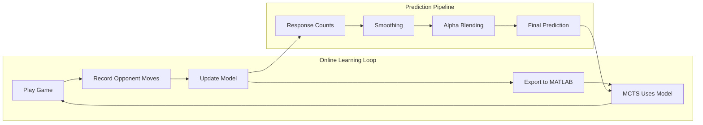
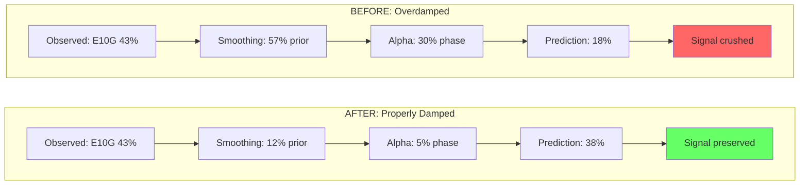

# Opponent Modeling for Tangled

## What is Opponent Modeling?

Opponent modeling is a technique in game-playing AI where an agent builds and maintains a model of its opponent's behavior to make better decisions. Rather than assuming optimal play (as in classical minimax) or random play (as in basic MCTS rollouts), opponent modeling attempts to predict what the actual opponent will do based on observed patterns.

### Theoretical Foundation

In game theory, the standard approach assumes rational opponents who play optimally. However, real opponents often:

1. **Have biases** - Prefer certain moves or strategies
2. **Make mistakes** - Deviate from optimal play in predictable ways
3. **Follow patterns** - Use heuristics or algorithms with identifiable signatures
4. **Adapt slowly** - Don't immediately counter new strategies

Opponent modeling exploits these tendencies by:
- Tracking historical behavior patterns
- Building probabilistic models of opponent responses
- Adjusting strategy to exploit predicted weaknesses

### Types of Opponent Models

| Model Type | Description | Complexity | Data Needed |
|------------|-------------|------------|-------------|
| **Frequency-based** | Count how often opponent makes each move | Low | ~50 games |
| **Response-conditional** | P(opponent_move \| our_last_move) | Medium | ~100 games |
| **State-based** | P(opponent_move \| board_state) | High | ~500+ games |
| **Feature-based** | Neural net on extracted features | Very High | ~1000+ games |

### Exploitation vs Exploration Trade-off

A key challenge in opponent modeling is balancing:
- **Exploitation**: Using the model to predict and counter opponent moves
- **Exploration**: Gathering data to improve the model
- **Robustness**: Not over-fitting to observed patterns that may change

---

## Opponent Modeling in Tangled

### Game Characteristics

Tangled has properties that make opponent modeling particularly valuable:

1. **Deterministic state transitions** - Same board position always has same available moves
2. **Alternating play** - Clear turn structure for modeling responses
3. **Limited action space** - At most 30 moves per position (15 edges × 2 colors)
4. **Observable state** - Full information game, no hidden state
5. **AI opponents** - MCTS Melissa likely has exploitable algorithmic patterns

### Our Current Opponent: MCTS Melissa

MCTS Melissa uses Monte Carlo Tree Search, which has known characteristics:
- Favors moves that look good in random rollouts
- May have MCTS-specific biases (UCB exploration constant)
- Deterministic given same position (or uses fixed random seed)
- Not adaptive - doesn't model us back

### Potential Exploitation Opportunities

| Pattern | How to Exploit |
|---------|----------------|
| Predictable opening | Prepare optimal counter-sequence |
| Response biases | Choose moves that trigger weak responses |
| Evaluation blind spots | Play positions MCTS undervalues |
| Time pressure patterns | Force positions requiring deep search |

---

## Current Data Analysis

### Data Collection Infrastructure

We have existing infrastructure in `snowdrop_tangled_agents/stats/`:

```
Tables:
- games: Game outcomes, opponent name, final scores
- moves: Per-move data with player, edge, color, state
- opponent_history: Designed for opponent modeling (partially populated)
```

### Current Dataset

As of 2026-01-22 (updated after implementation):
- **Total games**: 208
- **Opponent moves recorded**: 239 (in opponent model)
- **Response contexts with data**: 22/30
- **Data quality**: M1/M2 opponent moves now properly recorded (fixed in Phase 1)

### Observed Patterns

#### 1. Melissa's Opening When P1

When Melissa goes first, she plays E9G (our vertex edge) 100% of the time (11/11 samples). This is highly predictable.

#### 2. Response to Our E11G (Third Opening Move)

| Melissa's Response | Frequency | Our Win Rate |
|--------------------|-----------|--------------|
| E3G (hub edge) | 6 | 33% |
| E12G (her vertex) | 4 | 62% |
| E4P | 2 | 50% |
| E5G | 2 | 50% |
| E6P | 2 | 75% |
| E8P | 2 | 0% |

**Key finding**: When Melissa plays E8P after our E11G, we lose 100% of the time (small sample).

#### 3. Overall Edge Preferences

Melissa's most frequent moves:
1. E0G, E3G (hub edges, Green) - 17 each
2. E1G (hub edge) - 16
3. E2P, E6P (hub edges, Purple) - 14 each

Melissa favors hub edges over vertex edges in mid-game.

---

## Implementation Plan

### Phase 1: Fix Data Collection

**Problem**: Opponent moves at M1/M2 aren't being recorded.

**Root cause**: After our move, `wait_for_opponent_to_play()` may not be capturing the first opponent response correctly in the recording logic.

**Files to modify**:
- `play_tangled.py`: Fix opponent move recording in game loop

**Acceptance criteria**:
- All opponent moves appear in database
- Grey count decreases by 1 for each recorded move
- No duplicate move_numbers for same player

### Phase 2: Build Opponent Model

**Location**: `snowdrop_tangled_agents/stats/opponent_model.py`

```python
class OpponentModel:
    """
    Probabilistic model of opponent behavior.

    Uses Bayesian updating with Dirichlet prior for smoothing.
    """

    def __init__(self, opponent_name: str, smoothing: float = 1.0):
        self.opponent_name = opponent_name
        self.smoothing = smoothing  # Laplace smoothing parameter
        self.response_counts = {}   # (our_move) -> {opp_move: count}
        self.phase_counts = {}      # (grey_bucket) -> {opp_move: count}

    def predict_response(self,
                         our_last_move: tuple[int, str],
                         available_moves: list[tuple[int, str]],
                         grey_count: int) -> dict[tuple[int, str], float]:
        """
        Predict probability distribution over opponent's next move.

        Returns:
            Dictionary mapping (edge, color) to probability
        """
        pass

    def update(self, our_move: tuple, opp_move: tuple, grey_count: int):
        """Update model with observed opponent response."""
        pass

    def load_from_database(self, db_path: Path):
        """Initialize model from historical game data."""
        pass

    def save(self, path: Path):
        """Save model to file for MATLAB consumption."""
        pass
```

**Model details**:

1. **Response frequency table**: P(opp_move | our_last_move)
   - Key: (our_edge, our_color)
   - Value: Counter of (opp_edge, opp_color)

2. **Phase-based table**: P(opp_move | grey_bucket)
   - Buckets: early (12-15), mid (8-11), late (4-7), endgame (0-3)

3. **Combined prediction**:
   ```
   P(opp_move) = α * P(opp_move | our_last_move) + (1-α) * P(opp_move | phase)
   ```
   Where α is confidence weight based on sample size.

### Phase 3: Export for MATLAB

**Format**: `.mat` file with probability tables

```matlab
% opponent_model.mat structure:
% response_probs: 30x30 matrix (our_move_idx -> opp_move_probs)
% phase_probs: 4x30 matrix (phase -> opp_move_probs)
% move_index: mapping from (edge, color) to index
```

**Location**: `snowdrop_tangled_agents/matlab/rl/data/opponent_model.mat`

### Phase 4: MCTS Integration

**File**: `snowdrop_tangled_agents/matlab/rl/TangledMCTS.m`

**Changes**:

1. Load opponent model in constructor:
```matlab
properties
    OpponentModel struct
    UseOpponentModel logical = true
end

methods
    function this = TangledMCTS(options)
        % ... existing code ...
        this.loadOpponentModel();
    end

    function loadOpponentModel(this)
        modelPath = fullfile(fileparts(mfilename('fullpath')), ...
                            'data', 'opponent_model.mat');
        if exist(modelPath, 'file')
            this.OpponentModel = load(modelPath);
        end
    end
end
```

2. Modify rollout opponent move selection:
```matlab
function move = selectOpponentMove(this, state, ourLastMove)
    if this.UseOpponentModel && ~isempty(this.OpponentModel)
        % Sample from learned distribution
        probs = this.getOpponentProbs(state, ourLastMove);
        move = this.sampleFromDistribution(probs);
    else
        % Fallback to uniform random
        move = this.randomMove(state);
    end
end
```

### Phase 5: Online Learning

**Trigger**: After each game ends

**Process**:
1. Extract opponent moves from completed game
2. Update OpponentModel with new observations
3. Re-export to .mat file
4. MATLAB reloads on next game start

**Location**: `play_tangled.py` in `play_game()` method after game ends

```python
# After recording game end
if hasattr(self, 'opponent_model'):
    self.opponent_model.update_from_game(game_moves)
    self.opponent_model.save()
```

---

## Risk Analysis

### Risk 1: Insufficient Data

**Probability**: High (early in deployment)
**Impact**: Model predictions no better than random

**Mitigation**:
- Use **light** smoothing (α=0.1, not 1.0) - see [Feedback Loop Calibration](#feedback-loop-calibration)
- Fall back to phase-based priors when confidence < threshold
- Use confidence-adaptive alpha blending

> **Lesson Learned**: Strong smoothing (α=1.0) was initially recommended but caused severe overdamping. With 200+ games, 57% of predictions came from the uniform prior. Light smoothing (α=0.1) gives 88% weight to actual data.

### Risk 2: Opponent Adapts

**Probability**: Low (Melissa is static AI)
**Impact**: Model becomes stale

**Mitigation**:
- Weight recent games more heavily (exponential decay)
- Monitor prediction accuracy
- Reset model if accuracy drops

### Risk 3: Overfitting

**Probability**: Medium
**Impact**: Worse performance on novel positions

**Mitigation**:
- Regularization via smoothing
- Cross-validation on held-out games
- Hybrid with uniform random (ε-greedy)

### Risk 4: Implementation Bugs

**Probability**: Medium
**Impact**: Incorrect predictions, worse play

**Mitigation**:
- Unit tests for model updates
- Verify predictions match observed frequencies
- A/B testing with model on/off

---

## Feedback Loop Calibration

### The Learning Feedback System

The opponent model forms a closed-loop feedback system where observations influence predictions, which influence gameplay, which generates new observations:

<div align="center">



</div>

### Damping Theory

In control systems, feedback loops can be:

| Damping | Behavior | Effect on Learning |
|---------|----------|-------------------|
| **Underdamped** | Oscillates, overshoots | Model overreacts to recent data, unstable |
| **Critically damped** | Fastest convergence | Ideal - learns quickly, stays stable |
| **Overdamped** | Slow response | Model ignores data, stays near prior |

Our initial implementation was **severely overdamped** - the model predictions barely moved from uniform despite having 200+ games of data.

### Mathematical Analysis of Overdamping

#### Problem 1: Excessive Smoothing

Laplace smoothing adds pseudo-counts to prevent zero probabilities:

$$P(\text{move}) = \frac{\text{count} + \alpha}{\text{total} + \alpha \cdot K}$$

Where:
- $\alpha$ = smoothing parameter
- $K$ = number of possible actions (30 for Tangled)

**The issue**: With $\alpha = 1.0$ and $K = 30$, we add 30 pseudo-counts. For a context with $N$ real observations:

$$\text{Data Weight} = \frac{N}{N + 30}$$

| Real Samples (N) | Data Weight | Prior Weight |
|------------------|-------------|--------------|
| 10 | 25% | 75% |
| 20 | 40% | 60% |
| 30 | 50% | 50% |
| 100 | 77% | 23% |

With only 23 samples after E9G, **57% of the prediction came from the uniform prior**, crushing the observed signal.

**Prediction Weight Distribution (smoothing=1.0, N=23)**

```
Observed Data [████████████░░░░░░░░░░░░░░░░░░] 43%
Uniform Prior [█████████████████░░░░░░░░░░░░░] 57%  ← Dominates!
```

#### Problem 2: Fixed Alpha Blending

The prediction combines response-conditional and phase-conditional probabilities:

$$P(\text{move}) = \alpha_{\text{eff}} \cdot P(\text{move} | \text{our\_move}) + (1 - \alpha_{\text{eff}}) \cdot P(\text{move} | \text{phase})$$

Original formula: $\alpha_{\text{eff}} = \alpha \cdot \text{confidence}$

With $\alpha = 0.7$ and full confidence:
- Response-conditional weight: 70%
- Phase-conditional weight: 30%

**The issue**: Phase-conditional probabilities are diluted across all games, not specific to our last move. Even with good response data, 30% of the signal came from the less-informative phase prior.

#### Combined Effect

For E10G prediction after E9G (23 samples, 10 observations of E10G):

| Stage | E10G Probability | Raw Frequency |
|-------|------------------|---------------|
| Raw observed | 43.5% | 43.5% |
| After smoothing (α=1.0) | 20.8% | - |
| After alpha blend (70/30) | 18.2% | - |

The model predicted E10G at **18.2%** when Melissa actually plays it **43.5%** of the time!

### Calibration Fixes

#### Fix 1: Reduce Smoothing

Changed from $\alpha = 1.0$ to $\alpha = 0.1$:

$$\text{Data Weight} = \frac{N}{N + 3} \text{ (instead of } \frac{N}{N + 30}\text{)}$$

| Real Samples (N) | Old Data Weight | New Data Weight |
|------------------|-----------------|-----------------|
| 10 | 25% | 77% |
| 20 | 40% | 87% |
| 23 | 43% | 88% |

**Prediction Weight Distribution (smoothing=0.1, N=23)**

```
Observed Data [██████████████████████████░░░░] 88%  ← Now dominates!
Uniform Prior [████░░░░░░░░░░░░░░░░░░░░░░░░░░] 12%
```

#### Fix 2: Adaptive Alpha Blending

New formula that increases response weight when confidence is high:

$$\alpha_{\text{eff}} = \alpha + (0.95 - \alpha) \cdot \text{confidence}$$

| Confidence | Old α_eff | New α_eff |
|------------|-----------|-----------|
| 0.0 | 0.0 | 0.70 |
| 0.5 | 0.35 | 0.825 |
| 1.0 | 0.70 | 0.95 |

When we have strong data (confidence = 1.0), we now use **95% response-conditional** instead of 70%.

#### Results After Calibration

| Metric | Before | After |
|--------|--------|-------|
| E10G prediction (after E9G) | 18.2% | 37.7% |
| Raw observed frequency | 43.5% | 43.5% |
| Prediction error | -25.3pp | -5.8pp |
| 5-game test result | 0W/3L/0D | 1W/1L/3D |

### System Response Diagram

<div align="center">



</div>

### Key Insights

1. **Regularization vs. Signal**: Heavy regularization (smoothing, priors) is appropriate for very small datasets but counterproductive once sufficient data exists.

2. **Confidence-Adaptive Parameters**: Fixed hyperparameters can't handle varying data quality across contexts. Adaptive formulas that increase data weight with confidence work better.

3. **Monitor Prediction Calibration**: Always compare model predictions to observed frequencies. Large gaps indicate miscalibration.

4. **Feedback Loop Stability**: In online learning, overdamped systems fail to learn from new data. The model should respond meaningfully to observations while avoiding instability.

### Recommended Hyperparameters

| Parameter | Value | Rationale |
|-----------|-------|-----------|
| Smoothing | 0.1 | Adds ~3 pseudo-counts, 88% data weight at N=23 |
| Base Alpha | 0.7 | Fallback to phase when no response data |
| Max Alpha | 0.95 | Almost full response weight when confident |
| Confidence Threshold | 20 samples | Full confidence at 20+ observations |

---

## Success Metrics

### Primary Metrics

| Metric | Baseline | Target | Measurement |
|--------|----------|--------|-------------|
| Win rate | 33% | 40% | Last 50 games |
| Prediction accuracy | N/A | >50% | Top-3 move prediction |
| Loss rate | 33% | <25% | Last 50 games |

### Secondary Metrics

- Model confidence (average probability of predicted move)
- Exploitation rate (% of games using model predictions)
- Data collection completeness (% of opponent moves recorded)

---

## Timeline

| Phase | Description | Effort | Dependencies |
|-------|-------------|--------|--------------|
| 1 | Fix data collection | 1 hour | None |
| 2 | Build opponent model | 2 hours | Phase 1 |
| 3 | Export for MATLAB | 30 min | Phase 2 |
| 4 | MCTS integration | 1 hour | Phase 3 |
| 5 | Online learning | 1 hour | Phase 4 |
| 6 | Testing & tuning | 2 hours | Phase 5 |

**Total estimated effort**: 7-8 hours

---

## References

1. Billings, D. et al. (1998). "Opponent Modeling in Poker" - Foundational work on opponent modeling in imperfect information games

2. Lockett, A. & Miikkulainen, R. (2008). "Evolving Opponent Models for Texas Hold'em" - Neural network approach to opponent modeling

3. Bard, N. et al. (2013). "Online Implicit Agent Modelling" - Bayesian approach to opponent modeling without explicit model

4. Silver, D. et al. (2016). "Mastering the game of Go with deep neural networks and tree search" - AlphaGo's approach includes implicit opponent modeling via self-play

---

## Appendix: Database Schema

**Schema Version**: v6
**Location**: `~/.tangled/game_stats.db`

### Tables

| Table | Purpose | Used By |
|-------|---------|---------|
| `games` | Game outcomes, opponent, final scores | Stats reporting |
| `moves` | Per-move data for both players | **OpponentModel** |
| `opponent_history` | Detailed opponent tracking (unused) | - |
| `opponents` | Opponent profiles and clustering | Future use |
| `models` | Neural network metadata | MATLAB training |
| `training_data` | Versioned training samples | MATLAB training |
| `calibration` | Terminal state prediction accuracy | Debugging |

### moves table (primary source for opponent modeling)

The `OpponentModel` reads opponent behavior from this table, filtering by `player = 'opponent'`.

```sql
CREATE TABLE moves (
    id INTEGER PRIMARY KEY AUTOINCREMENT,
    game_id TEXT REFERENCES games(id),
    move_number INTEGER,
    player TEXT,                    -- 'us' or 'opponent'
    edge INTEGER,
    color TEXT,                     -- 'G' or 'P'
    score_after REAL,
    score_delta REAL,
    state_after TEXT,               -- 15-char board state
    thinking_time REAL,
    strategy_used TEXT,             -- 'opening', 'minimax', 'mcts', etc.
    -- ... additional solver statistics columns (v6)
    UNIQUE(game_id, move_number, player)
);
```

**Current data**: 292 opponent moves recorded across 208 games.

### opponent_history table (deprecated)

```sql
CREATE TABLE opponent_history (
    id INTEGER PRIMARY KEY AUTOINCREMENT,
    opponent_name TEXT NOT NULL,
    game_id TEXT REFERENCES games(id),
    move_number INTEGER,
    board_state_before TEXT,
    edge INTEGER,
    color TEXT,
    score_before REAL,
    score_after REAL,
    our_previous_move_edge INTEGER,
    our_previous_move_color TEXT,
    UNIQUE(game_id, move_number)
);
```

> **Note**: This table was designed for detailed opponent tracking but was not used. The simpler approach of storing opponent moves in the `moves` table (with `player = 'opponent'`) proved sufficient for the current opponent model.
